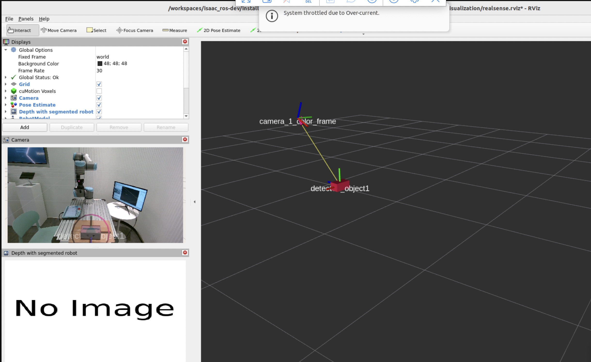

# Isaac Manipulator

This repository is for the demo in hsinchu office. Mainly follow the [tutorial](https://nvidia-isaac-ros.github.io/reference_workflows/isaac_manipulator/tutorials/tutorial_pick_and_place.html).

Here is the steps to run the pipeline with your own target objects.  
To implement with your custom gripper, refer to [custom-gripper.md](./docs/custom-gripper.md)

## Table of Contents

* [Hardware](#hardware)
* [Software Environment Setup](#software-environment-setup)
    * [Adjusted GitHub Repository](#adjusted-github-repository)
    * [ROS2 Package Build and Install](#ros2-package-build-and-install)
* [Robot Setup](#robot-setup)
    * [UR Teach Pendant Setup](#ur-teach-pendant-setup)
    * [Control the Gripper with CMD](#control-the-gripper-with-cmd)
    * [Setup a Work Boundary File](#setup-a-work-boundary-file)
* [Camera Setup](#camera-setup)
* [Models Setup](#models-setup)
    * [YoloV8](#yolov8)
    * [Foundation Pose](#foundation-pose)
    * [Object Detection Workflow Test](#object-detection-workflow-test)
* [Grasp File](#grasp-file)
    * [Computer with IsaacSim](#computer-with-isaacsim)
    * [Usd File of Gripper](#usd-file-of-gripper)
    * [Generate Grasp File](#generate-grasp-file)
* [Run the Whole Pipeline](#run-the-whole-pipeline)

## Hardware

- Nvidia Jetson Orin with external SSD
- ur10e
- Robotiq hande
- realsense D455

## Software Environment Setup

A docker environment is recommended. Follow the [tutorial](https://nvidia-isaac-ros.github.io/reference_workflows/isaac_manipulator/tutorials/tutorial_pick_and_place.html#tutorial) to complete all of the setup including:
    
* Docker build
* Camera Setup and Calibration (Some hints refer to [Camera Setup](#camera-setup))
* Deep Learning Models Preparation (Some hints refer to [Models Setup](#models-setup))
* **Regarding the Robot Setup, follow the [section](#robot-setup)**

Because docker environment would be reset when we start a new one, *Build from Source* is more recommened than *installing with apt* for installing the ros2 packages, or you will need to reinstall all of the packages when the docker is restarted.

### Adjusted GitHub Repository

To complete the task of pick and place with robotiq hande gripper. We forked some repositories and made some modifications. When cloning the repositories, use the corresponding links and branches provided below:

* [isaac_manipulator](https://github.com/nexuni/isaac_manipulator/tree/hande-dev)
* [ros2_robotiq_gripper](https://github.com/nexuni/ros2_robotiq_gripper/tree/hande-dev)
* [robotiq_hande_description](https://github.com/nexuni/robotiq_hande_description/tree/linga-dev)
* Skip the part regarding `rt-detr`, we use `yolov8` here. For details, refer to [Models Setup](#models-setup).

### ROS2 Package Build and Install

During the entire process, it will be necessary to build and install the ROS 2 package multiple times. Here introduces the basic steps to build and install a ros2 package.

* Install the dependencies:
    ```bash
    sudo apt-get update

    rosdep update && rosdep install -i -r --from-paths \
    <PATH TO YOUR PACKAGE> \
    --ignore-src --rosdistro humble -y
    ```
* Build and install package:
    ```bash
    cd ${ISAAC_ROS_WS}
    colcon build --symlink-install --packages-up-to <YOUR PACKAGE NAME>
    ```
* **Remember to source the setup.bash every time you open a new terminal and finish a build command.**
    ```bash
    source ./install/setup.bash
    ```


## Robot Setup

### UR Teach Pendant Setup

The following setups are necessary to control the robot and the gripper via ros2:

1. Download  `rs485-1.0.urcap` from [here](https://github.com/UniversalRobots/Universal_Robots_ToolComm_Forwarder_URCap/releases) and install it to the UR teach pendant. This is the version to enable control ur robot and control the gripper with RS485 at the same time.
2. Follow the description on [web](https://nvidia-isaac-ros.github.io/reference_workflows/isaac_manipulator/tutorials/tutorial_e2e.html#set-up-ur-robot) to setup the `external_control` program with the `urcap` downloaded in step 1.
3. Everytime using the robot, you should follow the steps to activate the gripper:
    1. Go to `tool_io/io_interface_control` page on the UR teach pendant, set to `gripper`.
    2. Go to `urcaps/gripper` page, activate the gripper.
    3. Back to `tool_io/io_interface_control` page, change the value to `user`.
4. Create the virtual comport for controlling the gripper on your computer. The comport `/tmp/ttyUR` is created with the command:

    ``` bash
    ros2 run ur_robot_driver tool_communication.py --ros-args -p robot_ip:=[ROBOT_IP]
    ```
    After the settings in step3 and the creation of virtual comport, you could control the gripper from your computer.
    You could test the communication with the [test file](https://github.com/nexuni/ros2_robotiq_gripper/blob/main/robotiq_hardware_tests/src/gripper_interface_test.cpp). You could find the executable file at `${YOUR_WORKSPACE}/build/robotiq_hardware_tests/full_test`. (You need to clone the code relatived to the `robotiq_driver` package and build them in advanced.)
5. When you want to control the robot, follow the tutorial to run `ur_control.launch.py` or the cooresponding launch file. After the node in the main computer is launched, press `play` on the UR teach pendant to enable the robot. 

### Control the Gripper with CMD

You could control the hande gripper with ros2 action after starting the `controller` node or the `tool_communication` node. The control command is:

```bash
ros2 action send_goal /robotiq_gripper_controller/gripper_cmd control_msgs/action/GripperCommand "{command: {position: 0.025}}"
```

- `position` is the target position in unit of meter. `0.025` for open, `0.0` for closed.

### Setup a Work Boundary File

You should create a work boundary for `nvblox`. The working area will be shown as a red box when you run the [whole launch file](#run-the-whole-pipeline). Create a file named `<YOUR SETUP NAME>.yaml` under `isaac_manipulator/isaac_manipulator_bringup/config/nvblox/workspace_bounds`. Here is the [example file](./isaac_manipulator_bringup/config/nvblox/workspace_bounds/nexuni_demo.yaml). You only need to edit the numbers based on your working area.

## Camera Setup

Mainly follow the [tutorial](https://nvidia-isaac-ros.github.io/reference_workflows/isaac_manipulator/tutorials/tutorial_e2e.html#set-up-cameras-for-robot).

After the calibration, you could test the accuracy of the transformation from `base` to `camera` with `apriltag`. Here are the steps:

1. Clone [isaac_ros_apriltag](https://github.com/NVIDIA-ISAAC-ROS/isaac_ros_apriltag) and build it.
2. Print a tag out. We normally use `tag36h11` family. You could generate one with [online web](https://chaitanyantr.github.io/apriltag.html). Put it on the table where could be seen by the camera and is also reachable by the robot arm.
3. Open three terminal to run the following command to start a rviz2 with a robot.
    * `ros2 launch ur_robot_driver ur_control.launch.py ur_type:=ur10e robot_ip:=<YOUR ROBOT IP> launch_rviz:=false`
    * `ros2 launch isaac_ros_cumotion_examples ur.launch.py ur_type:=ur10e robot_ip:=<YOUR ROBOT IP> launch_rviz:=true`
    * `ros2 launch isaac_ros_apriltag isaac_ros_apriltag_realsense.launch.py`
4. Edit the `child-frame-id` name from `camera_link` to `camera_1_link` in your calibration file and run the file on another terminal with `ros2 launch <ABSOLUTE FILEPATH TO THE CALIBRATION FILE>`.
5. Print out the transform from robot to tag with `ros2 run tf2_ros tf2_echo base <YOUR TAG FRAME NAME>`. The tag frame name could be found on rviz2 under `tf2/frame`. The name should be like `tag36h11:0`. Record the number of translation from the output.
6. Move yout robot arm to the point of the translation (any orientation is ok) we get in step 4. The tcp of arm should point to the apriltag. It is normal to have some error (less than 7cm) along the camera's axis because `isaac_ros_apriltag` only use RGB image to localize to tag.

## Models Setup
There are two parts in this section: Yolov8 and Foundation Pose.

### YoloV8

You should train a yolov8 model for your target objects. To complete the setting, the following files are necessary:

* model files: 
    * `robot8.onnx` 
    * `robot8.plan`
* `labels.yaml`

These 3 files should be stored under the folder `${ISAAC_ROS_WS}/isaac_ros_assets/models/yolov8`.

#### Model Files

This could be generated from `.pt` file. If you use `ultralytics` to train your model. You could easily get an .onnx file with the following python code. [Reference](https://docs.ultralytics.com/modes/export/)

```python
from ultralytics import YOLO

# Load a model
model = YOLO("yolo11n.pt")  # load an official model
model = YOLO("path/to/best.pt")  # load a custom trained model

# Export the model
model.export(format="onnx")
```

After you get an onnx file, you need to parse it to a .plan file. **You need to run the following command with your running environment, e.g. inside docker, to avoid mismatch version of TensorRt.**

```bash
/usr/src/tensorrt/bin/trtexec --onnx=${ISAAC_ROS_WS}/isaac_ros_assets/models/yolov8/robot8.onnx --saveEngine=${ISAAC_ROS_WS}/isaac_ros_assets/models/yolov8/robot8.plan
```
#### Labels YAML

You could create the `labels.yaml` from scratch based on your labels. Here is an example:

```yaml
yolov8:
  labels:
    0: Toilet_paper
    1: Box
    2: Cookie
    3: Teabags_in_can
    4: Oligowater
    5: OREO
```

The key of first 2 layers are fixed. You only need to fill in class id and name pairs. The name of each class is also the name of the folder which stores the 3D scanning data of each class.([3D Scanning Data](#3d-scanning-data))

### Foundation Pose

First of all, you need follow the [tutorial](https://nvidia-isaac-ros.github.io/reference_workflows/isaac_manipulator/tutorials/tutorial_e2e.html#set-up-perception-deep-learning-models) to prepare the TensorRT engine plans of `refine_model` and `score_model`.

#### 3D Scanning Data

For each kind of your target objects, follow this [web](https://nvidia-isaac-ros.github.io/concepts/pose_estimation/foundationpose/tutorial_create_your_own_mesh.html) to get `.obj` and the texture image. **You should also get an `.usdz` file during the process. Usdz file will be used in the [Grasp File](#grasp-file) section.**

Obj and texture image of each object should have the same name but are under different folders. Here, we use `AR-Code-Object-Capture-app.obj` and `baked_mesh_tex0.png`. The name of folders should be exactly the same as the name of the corresponding calss defined in `labels.yaml`. These folders of 3D sacnning data must be stored under `${ISAAC_ROS_WS}/isaac_ros_assets/isaac_ros_foundationpose`. Here is the corresponding file structure to the example `labels.yaml` mentioned above:

```
...isaac_ros_foundationpose
    |
    |- Toilet_paper
    |   |- AR-Code-Object-Capture-app.obj
    |   |- AR-Code-Object-Capture-app.obj.mtl
    |   |- baked_mesh_ao0.png
    |   |- baked_mesh_norm0.png
    |   |- baked_mesh_tex0.png
    |
    |- Box
    |   |- AR-Code-Object-Capture-app.obj
    |   |- AR-Code-Object-Capture-app.obj.mtl
    |   |- baked_mesh_ao0.png
    |   |- baked_mesh_norm0.png
    |   |- baked_mesh_tex0.png
    |
    |- Cookie
    |   |- ...
    |
    |- Teabags_in_can
    |   |- ...
    |
    |- Oligowater
    |   |- ...
    |
    |- OREO
        |- ...
```

### Object Detection Workflow Test

To check if all of the files, models, and the file structures are correct, we provide an isolated launch file which only runs the objection detection part.

```bash
ros2 launch isaac_manipulator_pick_and_place object_detection_stream.launch.py static_transform:=<ABSOLUTE FILE PATH TO THE CAMERA CALIBRATION LAUNCH FILE> yolov8_object_class_id:=<YOUR TARGET CLASS ID>
```

* Noted: the `child-frame-id` of the calibration launch file should be `camera_1_link`.
* This is what it looks like if everything works fine.
    
* The red box is the estimated pose of the object, which should match the real one in the camera.

## Grasp File

To get the grasp pose for pick-and-place, a grasp file is necessary. Grasp file contains multiple pre-defined poses to grasp the object. The program will choose the best one for planning.

To get the grasp file, you need a computer, which has already installed the `IsaacSim`, the `.usdz` file of the object, and the `.usd` file of your gripper.

### Computer with IsaacSim

[Installation Guide](https://docs.omniverse.nvidia.com/isaacsim/latest/installation/install_workstation.html#omniverse-launcher)
An `IsaacSim` installed in a Linux computer is recommened. We faced some issues with the `IsaacSim` in docker. 

### Usd File of Gripper

You could generate a usd file with the `URDF Importer` of `IsaacSim`. [Tutorial](https://docs.omniverse.nvidia.com/isaacsim/latest/advanced_tutorials/tutorial_advanced_import_urdf.html)

If youe are using Robotiq Hande, you could use the [urdf file](./isaac_manipulator_pick_and_place/urdf/robotiq_hande_gripper.urdf) in this repo.

### Generate Grasp File

You could follow the [tutorial](https://docs.isaacsim.omniverse.nvidia.com/latest/robot_setup/grasp_editor.html) to generate the grasp file. The file name must follow the format `[GRIPPER NAME]_grasps_[OBJECT NAME].yaml`, e.g. `robotiq_hande_grasps_Toilet_paper.yaml`.

TODO: I met some issues to use the Grasp Editor in IsaacSim. The workaround is to manually record the relative pose of the gripper as grasping, that the target object's position must be [0,0,0] and the orientation is [1,0,0,0] (wxyz). 

Here is an example of a grasp file generated from scratch:

```yaml
format: isaac_grasp
format_version: 1.0

object_frame: /centered
gripper_frame: /robotiq_hande_coupler


# Only grasps/**/position and grasps/**/orientation are necessary
grasps:
    "grasp_0":
      position: [0.15644, 0.02777, 0.16579]
      orientation: {w:  0.24183, xyz: [0.64703, -0.71093, -0.13207]}
    "grasp_1":
      position: [-0.04135, 0.15417, 0.15794]
      orientation: {w:  0.28049, xyz: [0.95455, 0.02899, 0.0965]}
```

**Noted**: Fine-tuning the position on-site is necessary. It is impossible to get a perfect grasp file only with IsaacSim.

## Run the Whole Pipeline

After all the preparation are completed, we could start the pick-and-place.

1. Run `tool_communication` to create the virtual port
    ```bash
    ros2 run ur_robot_driver tool_communication.py --ros-args -p robot_ip:=<YOUR ROBOT IP>
    ```

2. Start the main launch file
    ```bash
    ros2 launch isaac_manipulator_pick_and_place ur_hande_pick_and_place.launch.py ur_type:=ur10e robot_ip:=<YOUR ROBOT IP> gripper_type:=robotiq_hande camera_type:=realsense setup:=<YOUR SETUP NAME> use_pose_from_rviz:=True num_cameras:=1 kinematics_parameters_file:=my_robot_calibration.yaml yolov8_object_class_id:=<YOUT TARGET CLASS ID>
    ```

    * The `kinematics_parameters_file` is from the [robot calibration](https://docs.ros.org/en/humble/p/ur_robot_driver/doc/installation/robot_setup.html#extract-calibration-information).
    * The setup name is the name you defined in the `isaac_manipulator_bringup/launch/static_transforms.launch.py`. [Step 6 in Description](https://nvidia-isaac-ros.github.io/reference_workflows/isaac_manipulator/tutorials/tutorial_e2e.html#set-up-cameras-for-robot). **Must use the same name as the[Work Boundary File](#setup-a-work-boundary-file).**

3. Send the first action command to trigger the yolov8 detection
    ```bash
    ros2 action send_goal /get_objects isaac_manipulator_interfaces/action/GetObjects {}
    ```

4. Send a command to trigger the rest of the pipeline, including foundation pose, grasp pose estimation, planning, gripper controlling.
    ```bash
    ros2 action send_goal /pick_and_place isaac_manipulator_interfaces/action/PickAndPlace "{object_id : <TARGET OBJECT ID>}"
    ```

    or 

    ```bash
    ros2 action send_goal /pick_and_place isaac_manipulator_interfaces/action/PickAndPlace "{object_id: 0, place_pose: {position: {x: 0.239, y: 0.659, z: 0.368}, orientation: {x: 0.550, y: 0.519, z: 0.477, w: 0.448}}}"
    ```